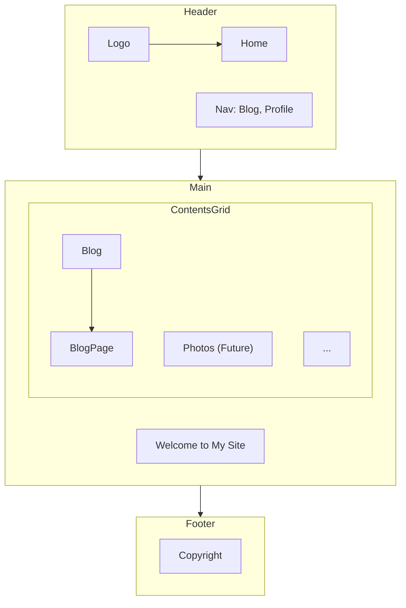
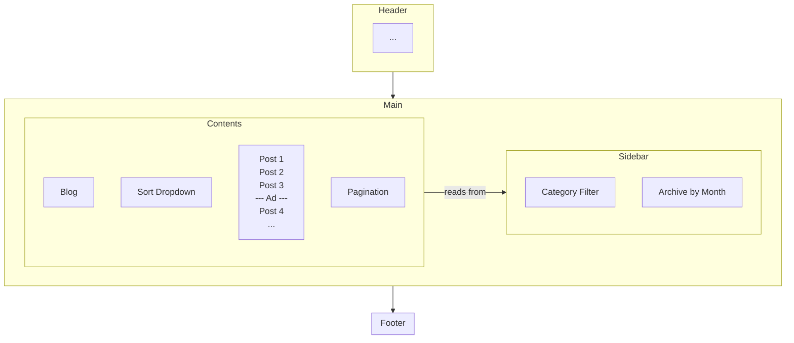
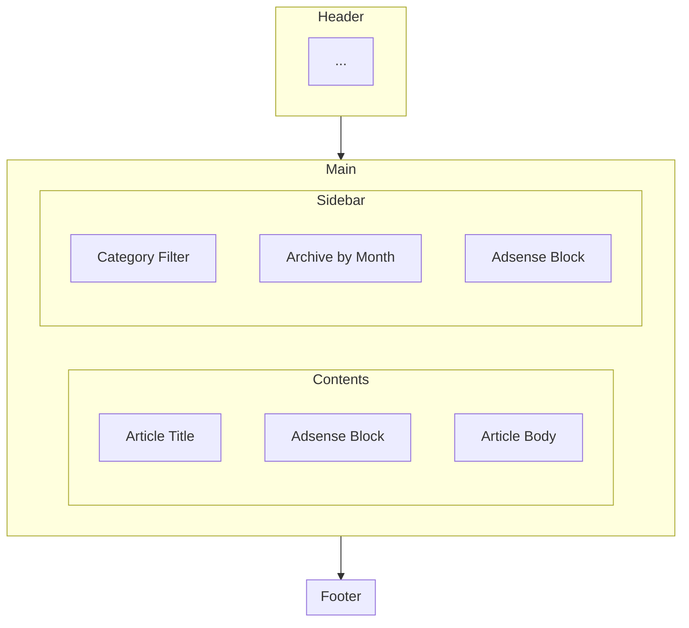
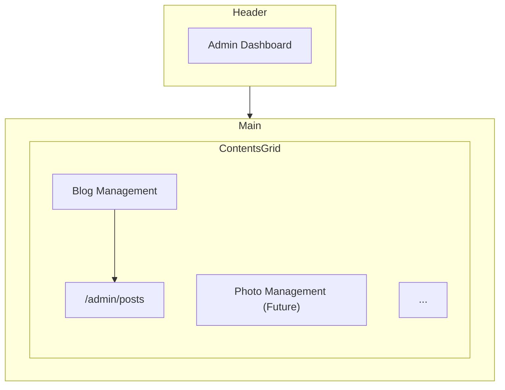
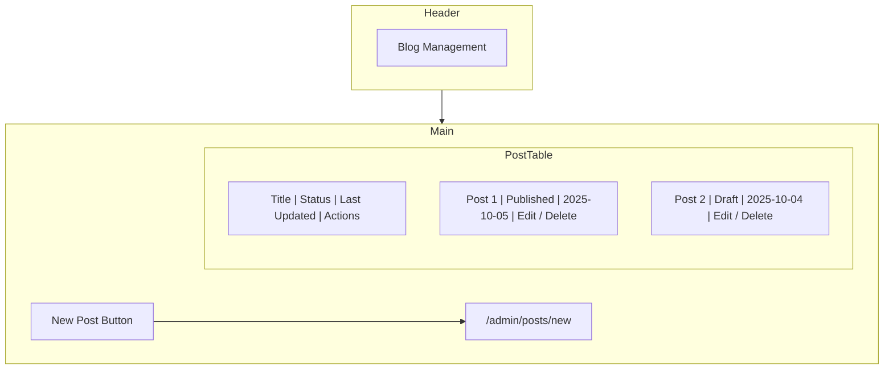
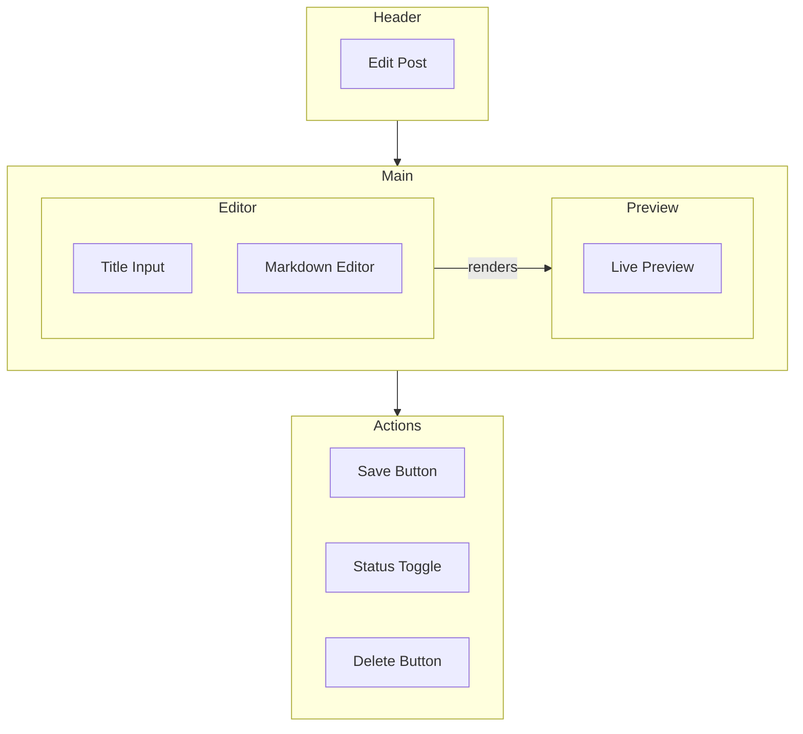
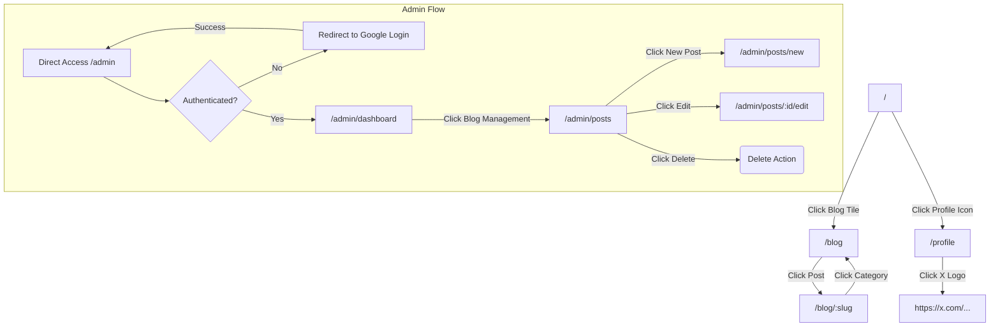

# 画面設計書

## 1. 画面レイアウト（ワイヤーフレーム）

MarkdownとMermaidを用いて各ページの主要なレイアウトを定義する。

### 1.1. トップページ

### 1.2. ブログ一覧ページ

### 1.3. ブログ詳細ページ

### 1.4. 管理者ページ

#### 1.4.1. ダッシュボード

#### 1.4.2. 記事一覧

#### 1.4.3. 記事編集

- **新規作成時:** エディタにはデフォルトのテンプレートが表示される。
- **プレビュー:** Markdownのプレビューエリアでは、Front Matter部分はテーブル形式などで整形して表示し、本文のみをレンダリングする。これにより、メタデータと本文のプレビューを明確に分離する。

## 2. 画面デザイン

- **カラー構成:**
  - **メイン:** `zinc-200` (背景など)
  - **サブ:** `yellow-300` (アクセント、ホバーエフェクトなど)
  - **アクセント:** `indigo-400` (ボタン、リンクなど)
  - **テキスト:** `zinc-800` (基本テキスト), `white` (ボタンテキストなど)
- **フォント:**
  - **基本:** `Noto Sans JP` (システムフォールバック: `sans-serif`)
  - **コード:** `Roboto Mono` (システムフォールバック: `monospace`)
- **アイコン:** `Material Icons` または `Heroicons` を利用。

## 3. 画面遷移図

## 4. UI要素定義 (Atomic Design)

### 4.1. Atoms (原子)
- **Button:**
  - `PrimaryButton`: アクセントカラー(`indigo-400`)背景。ホバー時にサブカラー(`yellow-300`)のボーダーを表示。
  - `SecondaryButton`: ボーダーのみ。ホバー時に背景色が変わる。
- **Text:** `h1`, `h2`, `h3`, `p`, `a` などの基本的なテキスト要素。
- **Input:** テキスト入力、テキストエリア、チェックボックス。
- **Icon:** 各種アイコン。
- **Logo:** サイトロゴ。
- **AdsenseBlock:** Google AdSense広告を表示するコンポーネント。

### 4.2. Molecules (分子)
- **PostCard:** (ブログ一覧用) サムネイル画像、タイトル、公開日、カテゴリタグを含むカード。
- **SearchForm:** `Input` と `Button` を組み合わせた検索フォーム。
- **CategoryLink:** カテゴリ名のリンク。クリックでフィルタリング。
- **ArchiveLink:** 年月ごとのアーカイブリンク。

### 4.3. Organisms (有機体)
- **Header:** `Logo`, `Nav`, `Profile Icon` を含むサイトヘッダー。
- **PostList:** `PostCard` を複数表示するリスト。
- **Sidebar:** `CategoryFilter` と `ArchiveFilter` を含むサイドバー。
- **MarkdownEditorWithPreview:** 管理者ページのMarkdownエディタとプレビューの組み合わせ。

### 4.4. Templates (テンプレート)
- **DefaultLayout:** `Header`と`Footer`を持つ基本的なページレイアウト。
- **BlogLayout:** `DefaultLayout`に`Sidebar`を追加したブログ用レイアウト。

### 4.5. Pages (ページ)
- **HomePage:** `DefaultLayout`にトップページのコンテンツを配置。
- **BlogIndexPage:** `BlogLayout`に`PostList`を配置。
- **AdminEditorPage:** 管理者用のエディタ画面。
