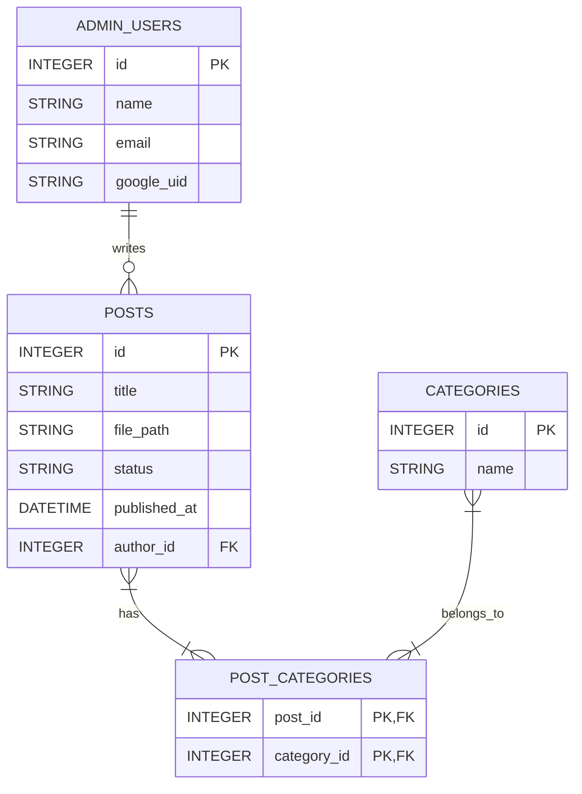

# データモデル設計書

## 1. エンティティ・リレーションシップ図 (ER図)

## 2. 論理データ定義書

### 2.1. ADMIN_USERS (管理者ユーザー)

| 論理名 | 物理名 | データ型 | 制約 | 説明 |
| :--- | :--- | :--- | :--- | :--- |
| ID | `id` | INTEGER | PK, AutoIncrement | 管理者ID |
| 名前 | `name` | STRING | NOT NULL | 表示名 |
| メールアドレス | `email` | STRING | NOT NULL, UNIQUE | Googleアカウントのメールアドレス |
| Google UID | `google_uid` | STRING | NOT NULL, UNIQUE | Identity Platformが発行するUID |
| 作成日時 | `created_at` | DATETIME | NOT NULL | レコード作成日時 |
| 更新日時 | `updated_at` | DATETIME | NOT NULL | レコード更新日時 |

### 2.2. POSTS (ブログ記事)

| 論理名 | 物理名 | データ型 | 制約 | 説明 |
| :--- | :--- | :--- | :--- | :--- |
| ID | `id` | INTEGER | PK, AutoIncrement | 記事ID |
| タイトル | `title` | STRING | NOT NULL | 記事のタイトル |
| ファイルパス | `file_path` | STRING | NOT NULL | Cloud Storage上のMarkdownファイルのパス |
| 公開ステータス | `status` | STRING | NOT NULL | `published` (公開) or `draft` (下書き) |
| 公開日時 | `published_at` | DATETIME | | `status`が`published`の場合の日時 |
| 著者ID | `author_id` | INTEGER | FK (ADMIN_USERS.id) | 記事の作成者 |
| 作成日時 | `created_at` | DATETIME | NOT NULL | レコード作成日時 |
| 更新日時 | `updated_at` | DATETIME | NOT NULL | レコード更新日時 |

### 2.3. CATEGORIES (カテゴリ)

| 論理名 | 物理名 | データ型 | 制約 | 説明 |
| :--- | :--- | :--- | :--- | :--- |
| ID | `id` | INTEGER | PK, AutoIncrement | カテゴリID |
| カテゴリ名 | `name` | STRING | NOT NULL, UNIQUE | カテゴリの名前 (例: 子育て) |
| 作成日時 | `created_at` | DATETIME | NOT NULL | レコード作成日時 |
| 更新日時 | `updated_at` | DATETIME | NOT NULL | レコード更新日時 |

### 2.4. POST_CATEGORIES (記事-カテゴリ中間テーブル)

| 論理名 | 物理名 | データ型 | 制約 | 説明 |
| :--- | :--- | :--- | :--- | :--- |
| 記事ID | `post_id` | INTEGER | PK, FK (POSTS.id) | 記事ID |
| カテゴリID | `category_id` | INTEGER | PK, FK (CATEGORIES.id) | カテゴリID |