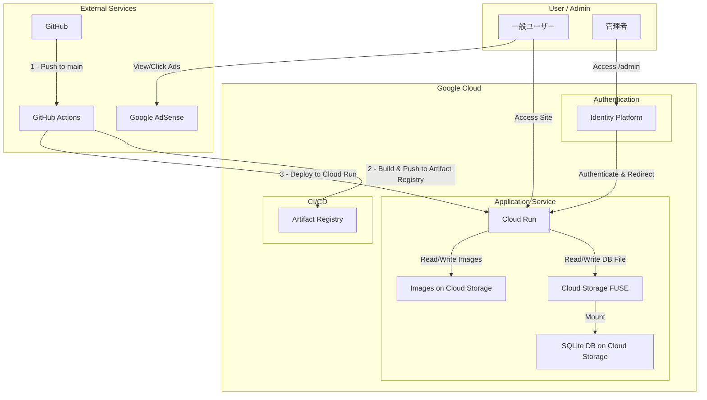
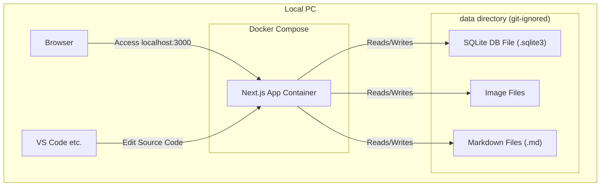
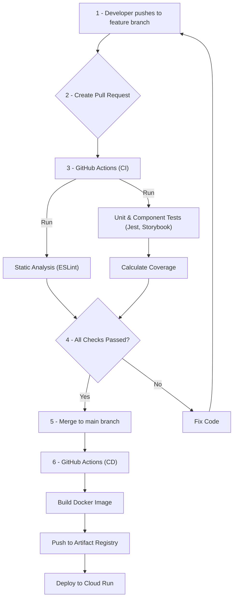

# インフラ・アーキテクチャ設計書

## 1. システム構成図

### 1.1. 本番環境構成図

### 1.2. 開発環境構成図

## 2. 技術スタック定義

| 分類                     | 技術                        | バージョン | 選定理由                                                                              |
| :----------------------- | :-------------------------- | :--------- | :------------------------------------------------------------------------------------ |
| **Web フレームワーク**   | Next.js                     | 最新 LTS   | React ベースのモダンな開発、SSR/SSG 対応、開発体験の良さから選定。                    |
| **言語**                 | TypeScript                  | 最新       | 静的型付けによる開発時のエラー検知とコード品質向上のため。                            |
| **データベース**         | SQLite3                     | 3.x        | 低コストでの運用、ファイルベースでの管理のしやすさという要件に基づき選定。            |
| **DB ORM**               | TypeORM                     | 最新       | TypeScript との親和性が高く、多機能な ORM であるため。                                |
| **認証**                 | Identity Platform           | -          | Google Cloud のフルマネージド認証サービスであり、高いセキュリティと拡張性を持つため。 |
| **静的解析**             | ESLint                      | 最新       | コードの一貫性を保ち、潜在的なバグを早期に発見するため。                              |
| **フォーマッター**       | Prettier                    | 最新       | コードスタイルを自動で統一し、レビューの負担を軽減するため。                          |
| **テスト**               | Jest, React Testing Library | 最新       | 標準的なテストツールであり、エコシステムが充実しているため。                          |
| **コンポーネントテスト** | Storybook                   | 最新       | UI コンポーネントを独立して開発・確認できるため。                                     |

## 3. 環境仕様の詳細

### 3.1. 本番環境 (Cloud Run)

- **リージョン:** `asia-northeast1` (東京)
- **CPU:** 1 vCPU (最小構成から開始し、負荷に応じてスケールアップ)
- **メモリ:** 512MiB (最小構成から開始し、負荷に応じてスケールアップ)
- **インスタンス数:** 最小 0, 最大 2 (負荷に応じて自動スケール)
- **DB:** Cloud Storage FUSE 経由でマウントした SQLite3 ファイルを利用。

### 3.2. 開発環境

- **実行環境:** Docker Compose
- **Node.js:** `anyenv` と `nodenv` で管理されている最新 LTS バージョンを利用。
- **DB:** ローカルの`data/`ディレクトリに配置された SQLite3 ファイル。

## 4. CI/CD フロー概要

